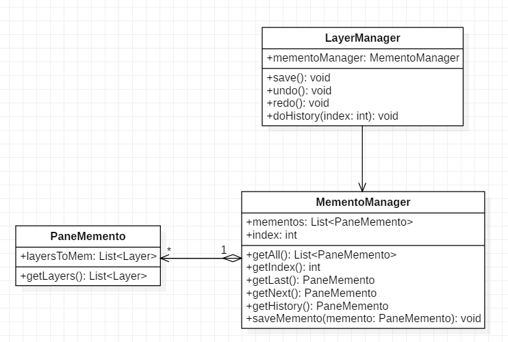

# MySketchpad

一个简易图形绘制软件，使用 **javafx** 编写而成

开发环境：Eclipse，jdk1.8.0

- 目录
  - 界面展示与演示视频
  - 功能描述
  - 用户手册
  - 代码结构
  - UML类图

- 项目地址

  <https://github.com/161220004/MySketchpad>

- 版本历史

  <https://github.com/161220004/MySketchpad/commits/master>

### 界面展示

### 演示视频

请见 **demo文件夹** 下的mp4文件

### 功能描述

- 基础功能

  - 绘制默认大小的直线，椭圆（包括圆形），矩形，正三角形，正六边形
  - 允许用户通过文本框添加文字描述 
  - 单击可以选中图形，并允许对图形的拷贝复制 
  - 多个图形可以组合， 组合后的图形同样可以拷贝复制
  - 支持撤销上一步操作 

- 扩展功能

  - 为图形添加锚点，以显示选中图形
  - 删除选中的图形
  - 支持拖拽锚点调整图形大小
  - 支持拖拽图形调整位置
  - 支持设置在拖拽时选择是否实时显示锚点坐标
  - 支持使用属性面板输入数值精准调整图形大小，位置，以及边框宽度
  - 支持通过属性面板的颜色选择器改变图形的填充颜色和边框颜色
  - 支持撤销多步操作
  - 支持查看整个历史记录面板并直接回溯到任何一条历史记录
  - 支持设置历史记录模式（单分支/多分支）

  

### 用户手册

- 图形绘制方法
  - 只需在界面左侧的工具栏中点击想绘制的图形的对应按钮，就会在默认画布的默认位置绘制出一个默认大小的该图形
  - **左键单击**该图形可选中该图形，**按住Ctrl左键单击**另一图形可实现多个图形的复选/取消复选（组合）
  - 单选的图形会在界面右侧显示属性栏（描述，位置，大小，颜色），**多选或未选中图形则不显示属性栏**
  - 在选中图形时按下**Delete键可删除**选中的图形
  - 改变图形位置有两种方法：一是通过**直接鼠标拖动**该图形；二是选中该图形并**修改其属性面板**中位置坐标的值
  - 改变图形大小有两种方法：一是先选中该图形，则会显示出锚点，**鼠标拖动锚点**可实现大小的拖拽修改；二是选中该图形并**修改其属性面板**中X方向和Y方向的投影长度
  - 可以通过选中一个图形并改变其属性栏中的**填充/边框颜色**选择器的值来改变图形颜色
  - 图形属性栏中的可输入值均为**double类型**，非double类型则输入无效
  - 若在菜单栏的“设置”的“显示位置拖拽提示”上打勾，则实时使用标签显示拖拽中的锚点位置；否则不显示
- 描述文本框绘制方法
  - 只需在界面左侧的工具栏中点击**“T”图标**，可绘制一个默认文本框
  - 文本框的位置，大小和颜色的修改方法同上述图形修改方法
  - 文本框内容的修改：首先**选中**文本框，并**右键单击**，则出现光标，进入编辑模式；编辑结束后一定要**按下回车键**，则确认修改完成，退出编辑模式
- 复制粘贴方法
  - 选中一个或多个图形或文本框后，使用**Ctrl+C快捷键复制**，随后使用**Ctrl+V快捷键粘贴**
  - 粘贴图形的位置在每个图形的**原位置**
  - 一次复制可以进行**无限次粘贴**
- 撤销上一步方法
  - 使用**Ctrl+Z快捷键**可以进行**撤销单步**
  - 使用**Ctrl+Y快捷键**可以进行**重做单步**
  - **连续使用Ctrl+Z**可以实现**撤销多步**
  - **连续使用Ctrl+Y**可以实现**重做多步**

- 历史记录面板使用方法

  - 模仿PhotoShop的历史面板功能，**实时显示所有操作记录**
  - 一个小图标始终**标记着在当前所在的记录**
  - **单击任意一条历史记录，可以回退/重做到该记录的状态**
  - 若在某一条历史记录的基础上继续操作：
    - 若在菜单栏的“设置”的“使用多分支历史记录”上不打勾，则**只保留当前分支**（即在撤销前曾经的操作会被新操作覆盖）
    - 否则，在“使用多分支历史记录”上打勾，则**显示多个分支的所有历史记录**（不覆盖任何操作）

  

### 代码结构

#### src

- AldebaRain.sketchpad

  **App**.java    （Main函数）

  **Default**.java    （默认值，全局常量，例如图形的默认大小默认位置等）

  **State**.java    （管理状态，全局变量，例如是否设置历史记录多分支等）

  - AldebaRain.sketchpad.controllers    （MVC - C）

    **FrameController**.java    （界面主框架控制器）

    **ToolsController**.java    （绘制图形的工具栏控制器）

    **PropertiesController**.java    （属性面板控制器）

    **HistoryController**.java    （历史记录面板控制器）

  - AldebaRain.sketchpad.models    （MVC - M）
    - AldebaRain.sketchpad.models.anchor

      **Anchor**.java    （继承于javafx的Rectangle类型，是一个锚点）

      **AnchorID**.java    （enum，是锚点的方位枚举）

      **AnchorSet**.java    （abstract，是一个图形具备的锚点集，即一群锚点；同时是下面适配器模式的适配者类之一，另一个适配者是javafx自带的Node类型）

      **AnchorLineSet**.java    （继承于AnchorSet，是直线的锚点集，3个点）

      **AnchorShapeSet**.java    （abstract，继承于AnchorSet，是椭圆/矩形的锚点集，9个点）

      **AnchorEllipseSet**.java    （继承于AnchorShapeSet，是椭圆的锚点集）

      **AnchorRectangleSet**.java    （继承于AnchorShapeSet，是矩形的锚点集）

      **AnchorPolygonSet**.java    （继承于AnchorSet，是多边形包括三角形的锚点集，顶点数n个锚点）

      **AnchorTextSet**.java    （继承于AnchorRectangleSet，矩形文本框的锚点集）

    - AldebaRain.sketchpad.models.product

      **NodeType**.java    （enum，定义所绘制图形的枚举类型）

      **ANodeWA**.java    （abstract，适配器模式的目标抽象类；同时也是工厂模式的抽象产品类；而且还是原型模式的抽象原型类）

      **ShapeWA**.java    （有锚点图形，适配器模式的适配器类，适配者是AnchorSet和javafx的Shape，为子类适配器提供一些通用的函数代码）

      **LineWA**.java    （有锚点直线，继承于ShapeWA；同时也是工厂模式的具体产品类；而且还是原型模式的具体原型类）

      **EllipseWA**.java    （有锚点椭圆，继承于ShapeWA；同时也是工厂模式的具体产品类；而且还是原型模式的具体原型类）

      **RectangleWA**.java    （有锚点矩形，继承于ShapeWA；同时也是工厂模式的具体产品类；而且还是原型模式的具体原型类）

      **PolygonWA**.java    （有锚点多边形，继承于ShapeWA；同时也是工厂模式的具体产品类；而且还是原型模式的具体原型类）

      **TextWA**.java    （有锚点文本框，继承于RectangleWA；同时也是工厂模式的具体产品类；而且还是原型模式的具体原型类）

    - AldebaRain.sketchpad.models.factory

      **IPainter**.java    （interface，工厂模式的抽象工厂类）

      **LinePainter**.java    （使用IPainter接口，绘制有锚点直线，工厂模式的具体工厂类）

      **EllipsePainter**.java    （使用IPainter接口，绘制有锚点椭圆，工厂模式的具体工厂类）

      **RectanglePainter**.java    （使用IPainter接口，绘制有锚点矩形，工厂模式的具体工厂类）

      **PolygonPainter**.java    （使用IPainter接口，绘制有锚点多边形，工厂模式的具体工厂类）

      **TextPainter**.java    （使用IPainter接口，绘制有锚点文本框，工厂模式的具体工厂类）

  - AldebaRain.sketchpad.hierarchy

    **Layer**.java    （层次结构之图层，维护了一个该图层上所有图形的List）

    **LayerManager**.java    （层次结构之画布，一个画布有多个图层，，维护了一个该画布上图层的List以及当前操作所在图层的引用）

    **PaneManager**.java    （层次结构之画布管理器，单例模式，软件的一次运行仅有一个画布管理器，维护了一个运行时打开的所有画布的List以及当前操作所在画布的引用）

    （由于时间不够充分，该部分未能完全实现，最终的代码里只硬性创造了一个画布以及该画布上的一个图层，但代码的调用结构是按照上述层次来的）

  - AldebaRain.sketchpad.selector

    **Selector**.java    （图形选择器，维护了一个被选中图形的List，每个画布都有且仅有一个图形选择器）

    **Cllipboard**.java    （剪贴板，单例模式，软件的一次运行仅有一个剪贴板，维护了一个被选中后复制的图形的List）

  - AldebaRain.sketchpad.memento

    **PaneMemento**.java    （画布备份，备忘录模式的备忘录，备份整个画布）

    **MementoManager**.java    （历史记录管理者，备忘录模式的负责人，负责保存并传递历史记录）

#### resources

- img    （保存所有使用的图标icon）
- views    （MVC - V）
  - FrameView.fxml    （主界面）
  - ToolsView.fxml    （绘制工具栏）
  - PropertiesView.fxml    （属性面板）
  - HistoryView.fxml    （历史记录面板）

### UML 类图

在使用设计模式时，为了减少重复代码，在继承关系上，经常在最基本的设计模式上有所改动，如果这些改动造成了不合理的地方，恳请指出~

#### 部分类图（按设计模式分割，每部分只选取相关函数）

- 适配器模式 —— 实现有锚点图形

  

  

- 工厂模式 —— 实现图形绘制

  

  

- 原型模式 —— 复制与粘贴（图形深克隆）

  

  

- 单例模式 —— 画布管理器与剪贴板

  

  

- 备忘录模式 —— 撤销与重做/历史记录管理

  

  

#### 整体类图（省略了一些函数）

（未画出一个类的函数内调用其他类的函数的弱依赖关系；未画出用来存储全局常量/变量的类Default和State；未画出enum类）

